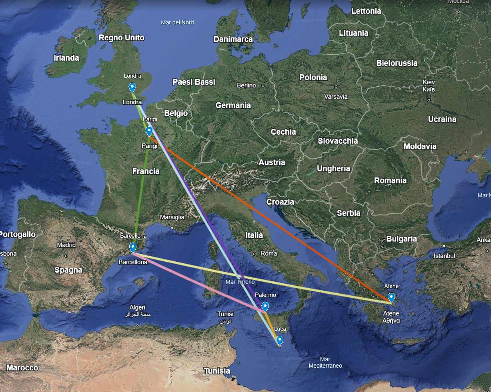

# Knowledge Representation & Reasoning — Rete di Voli con OWL e CWA

Base di conoscenza OWL per una rete di voli diretti tra città,
con inferenza automatica dei voli indiretti tramite forward chaining
e ragionamento a mondo chiuso (Closed World Assumption).

## Obiettivo

Modellare una rete di trasporti aerea usando owlready2 e dimostrare
come il ragionamento non monotono permetta di derivare nuova conoscenza
- o revocarla - a partire da aggiornamenti alla knowledge base.

## Funzionalità

- Definizione di una KB OWL con classi Città e Volo
- Derivazione automatica di voli indiretti tramite forward chaining
- Applicazione del CWA: tutto ciò che non è noto si assume falso
- Query automatiche su voli diretti, indiretti e assenti
- Dimostrazione del ragionamento non monotono: aggiungere un volo
  diretto può sbloccare nuovi voli indiretti

## Esempio di ragionamento



## Esecuzione

```bash
pip install -r requirements.txt
jupyter notebook knowledge_representation.ipynb
```

## Tecnologie

Python - owlready2 - Jupyter